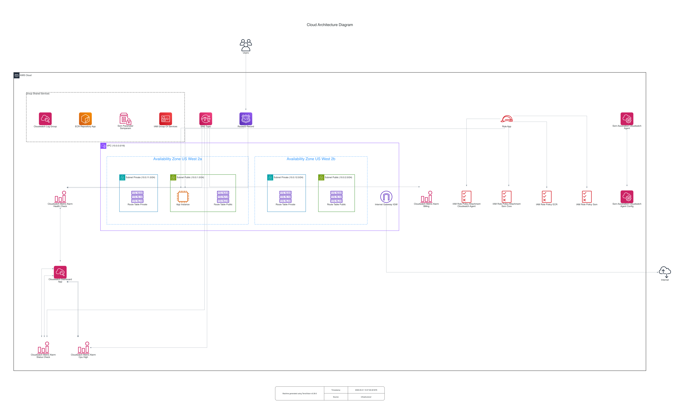

# Thrive Exercise

A Rails 8 web application deployed to AWS EC2 via Kamal, with infrastructure managed by Terraform.

---

## Quick Reference

```console
make help              # list all available commands
make dev               # start local Rails server
make test              # run tests
make lint              # run RuboCop
make scan              # run Brakeman + importmap security scans
make ci                # run all CI checks locally (scan + lint + test)
make build             # build Docker image locally
make run               # run Docker image locally (no AWS required)
make plan              # terraform plan
make url               # print the deployed app URL
make dashboard         # print the CloudWatch dashboard URL
make cloudwatch-agent  # re-run CloudWatch Agent config (if mem/disk metrics missing)
```

---

## Architecture

The main constraint on the project is sticking with the AWS free tier resources.  This effectively eliminates all compute options except for EC2 and it's budgeting limits us to only allows for a single node in constant use.  It also eliminates all forms of load balancing and round-robin DNS if we're sticking to AWS resources.  For these reasons it was decided doing any kind of multi-instance deployment was deferred until either other free services could be brought in (for example Cloudflare) or the free tier limitation was lifted.  More time would have allowed for provisioning of a domain name which would have allowed for multiple nodes via round-robin without lifting the free restriction.

The same restriction also weighs heavily on observability.  AWS managed Grafana would have been a great visibility tool but not in the free tier.  If more time was allowed Grafana Cloud offers a free tier and that could be integrated while holding to the free restriction.  Given that the following have been added for visibility: CloudWatch Metrics, Logs, Alarms, and a Dashboard.

So the architecture is an EC2 instance using an Amazon Linux 2023 ECS-optimized AMI and Docker deployed via Kamal.



Effort has been made to follow AWS best practices with the regards to the IAM and EC2 deployment.  Kamal on the nodes uses IAM instance profile for required activities.  AWS Systems Manager (SSM) was added to improve security, close port 22, and remove the need for managing SSH keys. Unfortunately Kamal did not support keyless SSH so the SSH key management had to be kept regardless.  Deploy parameters like the instance ID are stored in SSM that are created and maintained by Terraform. A dedicated VPC with public and private subnets across 2 AZs replaces the default VPC. The private subnets are unused at this point but are available for RDS or ECS later.  A NAT gateway would have violated the free tier restriction.

A separate GitHub Actions workflow has been added for Terraform.  `terraform plan` runs on PRs for changes to the `infrastructure/` folder.  `terraform apply` runs on merge when there are changes to the infrastructure folder.

I would have liked to find a more performant build process for the Docker container.  And this might have been my next improvement as it was a bit of a bottleneck.  Optimizing this would have greatly improved the iteration speed.

### Where Next?

While usually I would favour incremental improvements on infrastructure and CI/CD most of the infrastructure here is not very useful.  If you _really needed_ to keep this up and running I would advise a DNS zone, multiple nodes, and an LB as the biggest fast improvements.

Beyond that not a lot of this is reusable.  Moving to Fargate or EKS if the requirements make sense is the logical move.  That makes most of this work of little use moving forward.  Same with observability.  The current state is so strongly shaped by the restrictions that little should be kept of it.

## Developer Guide

### Prerequisites

- Ruby 3.3.6 (`rbenv` or `asdf` recommended)
- Docker Desktop
- Bundler (`gem install bundler`)

### Running locally

```console
cd app
bundle install
bin/rails server
```

Visit `http://localhost:3000`.

### Running the app in a container locally

No AWS credentials required.

```console
docker build -t thrive-exercise:local -f app/Dockerfile app

docker run \
  -e SECRET_KEY_BASE=$(openssl rand -hex 64) \
  -p 3000:80 \
  thrive-exercise:local
```

Visit `http://localhost:3000`.

### Running tests

```console
cd app
bin/rails test
bin/rails test:system
```

### Linting

```console
cd app
bin/rubocop
```

---

## Deploying with Kamal locally

Kamal can be run from your local machine as an alternative to triggering the GitHub Actions deploy workflow.

**Prerequisites:**
- AWS SSO authenticated (`aws sso login --profile admin`)
- `AWS_PROFILE=admin` exported
- Session Manager plugin installed (`brew install --cask session-manager-plugin`)

**Deploy:**
```console
cd app
bundle exec kamal deploy
```

`config/deploy.yml` will automatically fetch the instance IPs and secrets from SSM using your local AWS credentials. No additional environment variables needed.

**To target a specific image tag:**
```console
IMAGE_TAG=<git-sha> bundle exec kamal deploy
```

**Other useful commands:**
```console
bundle exec kamal app logs -f       # tail logs across all instances
bundle exec kamal app exec --interactive --reuse "bin/rails console"
bundle exec kamal rollback <version>
```

---

## Infrastructure

### Prerequisites

- Terraform >= 1.9
- AWS CLI
- `gh` CLI (for setting GitHub Actions secrets)
- An AWS account — configure SSO:

```console
aws configure sso --profile admin
aws sso login --profile admin
export AWS_PROFILE=admin
```

### First-time setup

Create the Terraform state bucket (run once):

```console
infrastructure/bin/bootstrap
```

Or with explicit values:

```console
infrastructure/bin/bootstrap [region] [account_id] [aws_profile]
```

### Initialise and apply Terraform

```console
cd infrastructure
terraform init
terraform plan -var="alert_email=you@example.com"
terraform apply -var="alert_email=you@example.com"
```

### Setting GitHub Actions secrets

After `terraform apply`, push the generated secrets from SSM to GitHub Actions using the `gh` CLI (run from the repo root):

```console
for SECRET in SSH_PRIVATE_KEY SECRET_KEY_BASE USERNAME PASSWORD; do
  gh secret set "$SECRET" --body "$(aws ssm get-parameter \
    --name "/thrive-exercise/${SECRET}" \
    --with-decryption --query Parameter.Value --output text \
    --region us-west-2 --profile admin)"
done
```

### Accessing the instance

Access is via AWS SSM Session Manager — no SSH key or open port 22 required.

```console
# Get the instance ID from Terraform outputs
cd infrastructure && terraform output instance_id

# Start a session
aws ssm start-session --target <instance_id> --region us-west-2 --profile admin
```

Requires the [Session Manager plugin](https://docs.aws.amazon.com/systems-manager/latest/userguide/session-manager-working-with-install-plugin.html) installed locally.

### ECR — Container Registry

The ECR repository is provisioned by Terraform. Get the repository URL from Terraform outputs:

```console
cd infrastructure && terraform output ecr_repository_url
```

**Authenticate Docker to ECR:**

```console
aws ecr get-login-password --region us-west-2 --profile admin | \
  docker login --username AWS --password-stdin \
  071919116017.dkr.ecr.us-west-2.amazonaws.com
```

**Build and push to ECR:**

```console
ECR_URL=$(cd infrastructure && terraform output -raw ecr_repository_url)
IMAGE_TAG=$(git rev-parse --short HEAD)
docker build -t $ECR_URL:$IMAGE_TAG -t $ECR_URL:latest -f app/Dockerfile app
docker push $ECR_URL:$IMAGE_TAG
docker push $ECR_URL:latest
```
